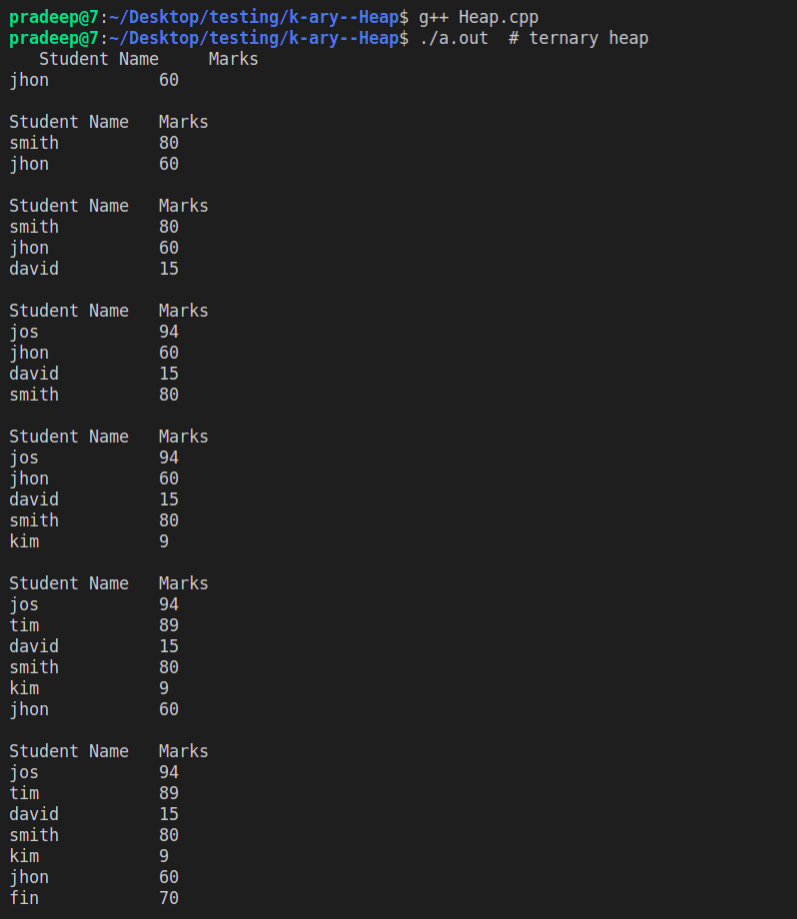
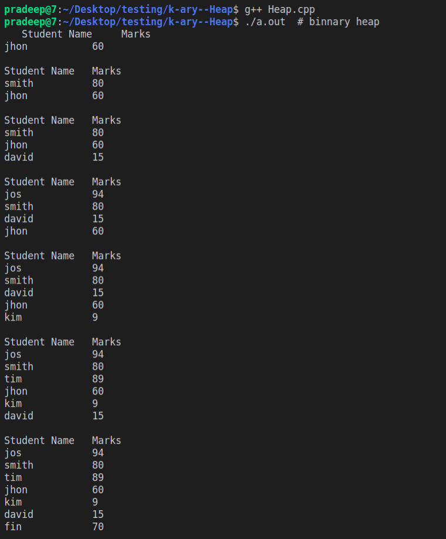

# k-ary--Heap

```cpp
void k_heap() {
    KHeap < int, functor > h(7);
    for (int i = 60; i > 0; i--)
        h.push(rand() % 200);

    h.print();
    h.sort();
    h.print();
}
```
<details>
    <summary><b>Ternary Heap Example👇🏻</b></summary>
    
</details>
<details>
    <summary><b>Binary Heap Example👇🏻</b></summary>
    
</details>

### Example
```cpp
void class_example() {
    struct Comparator {
        bool operator()(const Student & a,
            const Student & b) {
            return a.marks > b.marks;
        }
    };

    KHeap < Student, Comparator > heap(3);
    // example data
    vector < Student > university {
        Student("jhon", 18, 60),
            Student("smith", 21, 80),
            Student("david", 19, 15),
            Student("jos", 20, 94),
            Student("kim", 21, 9),
            Student("tim", 22, 89),
            Student("fin", 20, 70)
    };
    for (Student & each: university) {
        heap.push(each);
        Student::print_header();
        heap.print();
    }
}
```